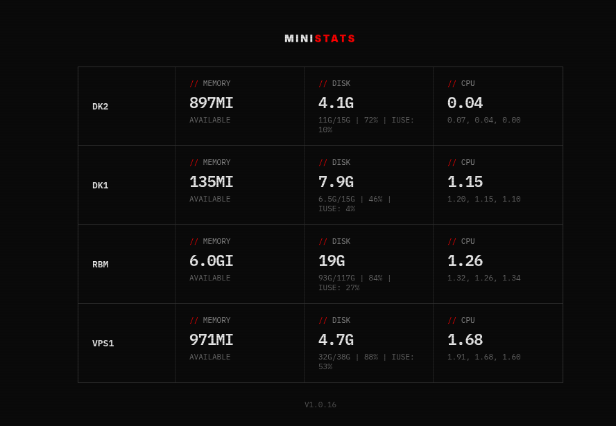

# MiniStats

<p align="center">
  <b>Real-time system metrics dashboard for multiple machines</b><br/>
  Lightweight. Zero-config. No bloat.
</p>

<p align="center">
  
  
  
</p>

## Why MiniStats?

Most monitoring tools are:

- heavy
- complex
- overkill for small setups

MiniStats is different:

- Run a single binary
- Connect your machines
- Instantly see what's going on

No Prometheus. No Grafana. No setup hell.

## Screenshot



## Features

- Real-time metrics via WebSocket
- CPU, memory, disk monitoring
- Centralized dashboard (multi-machine)
- Zero-config install
- Auto-update built-in
- x64 & arm64 support
- Ultra-lightweight footprint

## Quick Start

### 1. Install

```bash
curl -fsSL https://raw.githubusercontent.com/javimosch/ministats/master/scripts/install.sh | bash
```

### 2. Start Server

```bash
ministats server --port 9094
```

Open → http://localhost:9094

### 3. Connect Machines

```bash
ministats client --name my-machine --server http://YOUR_SERVER_IP:9094
```

Done. Metrics appear instantly.

## Commands

```bash
# version
ministats -v

# update
ministats update
```

## Build from Source

```bash
bun install
bun run build
```

## Architecture

```
[ client ] --->\
[ client ] ----->  [ server ] ---> Web UI
[ client ] --->/
```

- Clients stream metrics in real-time
- Server aggregates + displays
- No database required

## Comparison

| Feature | MiniStats | Netdata | Prometheus + Grafana |
|---------|-----------|---------|----------------------|
| Setup time | seconds | minutes | hours |
| Resource usage | very low | medium | high |
| Persistence | no | yes | yes |
| Complexity | minimal | medium | high |
| Multi-machine | yes | yes | yes |

Positioning: MiniStats = "monitoring you actually use"

## Use Cases

- Homelabs
- VPS / small infra
- Dev environments
- Quick diagnostics
- Side projects

## Philosophy

MiniStats focuses on:

- simplicity over features
- speed over completeness
- usability over configurability

If you need long-term metrics, alerts, and analytics → use bigger tools.
If you just want to see what's happening now → use MiniStats.

## Roadmap

- [ ] Alerts (lightweight)
- [ ] Auth / access control
- [ ] Docker image
- [ ] Persistent history (optional)
- [ ] Plugins / custom metrics

## Contributing

PRs welcome. Keep it simple.

## Support

If this project helps you, give it a star.
